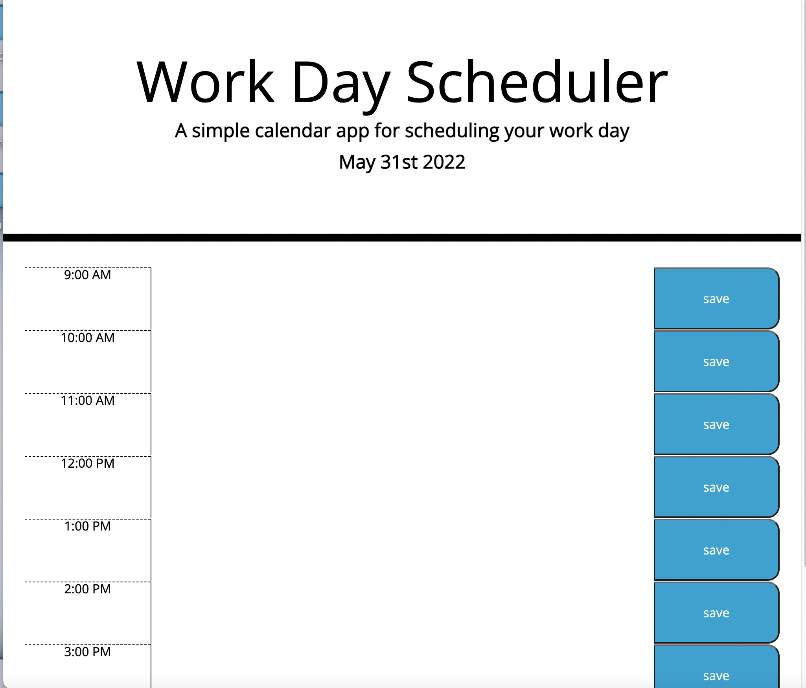

# Module-5-Challenge

Work Day Scheduler

This app allows users to enter events into an hourly day planner. The events are saved to local storage so that they persist between uses. 

It uses Moment.js to display the date and apply css styles to the time blocks depending on the time of day. 

[Module5-challenge link](https://ianahill.github.io/module5-challenge/)